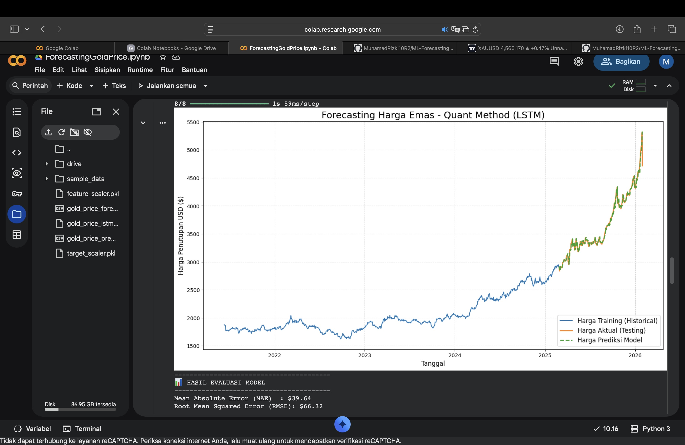

# 📈 Gold Price Forecasting using LSTM (Quantitative Finance Approach)


Proyek ini merupakan sistem peramalan harga emas (Gold Futures) tingkat lanjut menggunakan arsitektur **Deep Learning LSTM (Long Short-Term Memory)**. Berbeda dengan model prediksi harga konvensional, proyek ini menerapkan teknik **Quantitative Finance** untuk mengatasi masalah volatilitas ekstrem dan data non-stasioner.

---

## 🚀 Key Innovation: From Price to Returns
Banyak model peramalan gagal saat harga aset menembus **All-Time High (ATH)**, menghasilkan grafik prediksi yang datar (*flatline*). 

Dalam proyek ini, saya mengimplementasikan solusi **Stationarity**:
1. **Target Prediksi:** Alih-alih memprediksi harga absolut ($), model ini memprediksi **Daily Returns** (persentase perubahan harian).
2. **Data Reconstruction:** Hasil prediksi persentase kemudian direkonstruksi kembali menjadi harga nominal menggunakan harga historis terakhir.
3. **Multivariate Input:** Menggunakan 15+ fitur termasuk Volume dan Indikator Teknikal (RSI, MACD, Bollinger Bands) untuk menangkap pola momentum pasar.

---

## 📊 Results & Performance
Model berhasil mencapai presisi tinggi bahkan saat harga emas meroket menembus level ekstrem $5.000+:

| Metric | Value |
| :--- | :--- |
| **Mean Absolute Error (MAE)** | ~$39.64 |
| **Root Mean Squared Error (RMSE)** | ~$66.32 |
| **Accuracy Level** | > 99% (Harian) |

### 📈 Visualization
*(Upload screenshot grafik hasil akhir Anda ke folder 'images' di GitHub, lalu masukkan linknya di sini)*


---

## 🛠️ Tech Stack
- **Languages:** Python
- **Libraries:** TensorFlow, Keras, Pandas, NumPy, Scikit-Learn, Matplotlib
- **Tools:** Google Colab
- **Model:** Stacked LSTM with Dropout Layers & Early Stopping

---

## ⚙️ Model Architecture
- **Look-back Period:** 60 Days (Model melihat 2 bulan ke belakang untuk memprediksi hari esok).
- **LSTM Layers:** 2 Hidden Layers (50 units each).
- **Regularization:** Dropout (0.2) untuk mencegah overfitting.
- **Optimization:** Adam Optimizer dengan Early Stopping callback untuk efisiensi training.

---

## 📂 Project Structure
```text
├── gold_price_forecasting.ipynb   # Notebook utama (Gunakan di Google Colab)
├── gold_price_lstm_model.h5       # Model yang sudah dilatih
├── feature_scaler.pkl             # Scaler fitur (Normalisasi)
├── target_scaler.pkl              # Scaler target (Normalisasi)
└── README.md                      # Dokumentasi proyek
```

---
## 💡 How to Run
1. Buka Google Colab.
2. Upload file gold_price_forecasting.ipynb.
3. Unggah dataset gold_price_forecasting_dataset.csv saat diminta.
4. Jalankan seluruh cells untuk melihat proses training dan hasil visualisasi.

---
## 👨‍💻 Best Practices Applied
- Anti Data-Leakage: Proses scaling hanya dilakukan berdasarkan statistik data training.
- Stationarity Transformation: Menggunakan log-returns/daily returns untuk stabilitas numerik.
- 1-Step-Ahead Validation: Simulasi prediksi dunia nyata untuk kebutuhan day trading.

---
## 📝 Author
## [Muhamad Rizki]
- LinkedIn: [link-linkedin-anda]
